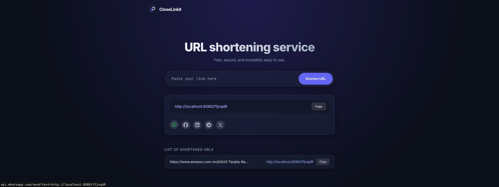
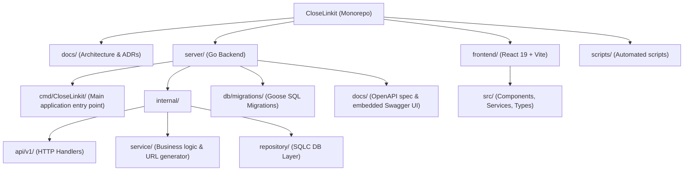
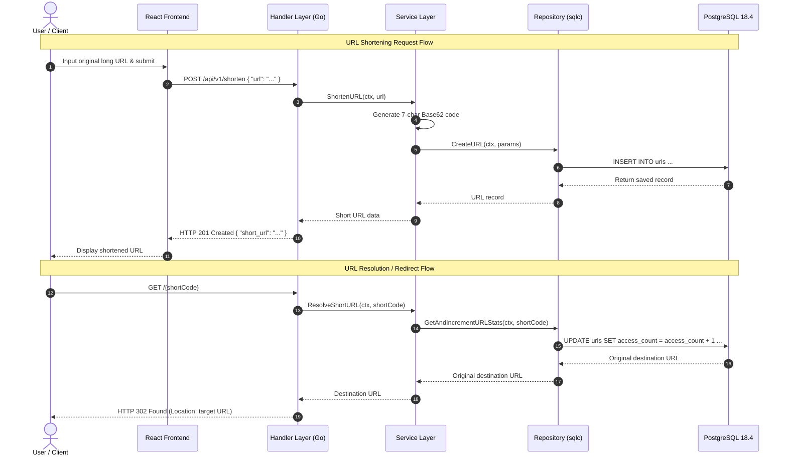

# CloseLinkit

CloseLinkit is a URL shortening service composed of a Go backend, a React frontend, and a PostgreSQL database. It exposes a REST API and a web client that allows users to create, retrieve, and resolve shortened URLs.

> **Current Version:** v0.1.0



## Main Features

- **URL Shortening:** Easily shorten long URLs.
- **Redirection:** Fast and reliable redirection from short codes to original URLs.
- **Statistics:** Track basic usage stats, like click counts.
- **Interactive Swagger UI**: Interactive API documentation embedded directly at `/docs/`.
- **Containerized Environment**: Full containerization via Docker Compose for easy development and deployment.
  
## Tech Stack

| Component | Technology | Version / Tooling |
| :--- | :--- | :--- |
| **Backend** | Go (`net/http`) | 1.26.2 |
| **Frontend** | React + TypeScript + Vite | React 19.2.7 |
| **Database** | PostgreSQL | 18.4 |
| **SQL Code Generator** | `sqlc` | v1.31.1 |
| **Database Migrations** | `goose` | v3.27.3 |
| **Orchestration** | Docker & Docker Compose | Compose Specification |

## Architecture & Data Flow

### Project Structure



### Data Flow Diagram



## Prerequisites

Before running CloseLinkit, ensure you have the following installed on your machine:
- **[Docker Engine](https://docs.docker.com/get-docker/)** (v20.10+ recommended)
- **[Docker Compose](https://docs.docker.com/compose/)** (v2.0+)
- **Go 1.26.2+** *(optional, required only if running migrations or tests locally outside Docker)*
- **A `.env` file** (see the [Environment Variables](#environment-variables) section below)

## Environment Variables

Copy the provided `.env.example` to `.env` and adjust the values if necessary.

```bash
cp .env.example .env
```

Below is an overview of the environment variables used across the application:

| Variable | Default Value | Description |
| :--- | :--- | :--- |
| `POSTGRES_USER` | `postgres` | Username for the PostgreSQL database container |
| `POSTGRES_PASSWORD` | `postgres123` | Password for the PostgreSQL database container |
| `POSTGRES_DB` | `CloseLinkit` | Name of the default database created on startup |
| `DB_HOST_PORT` | `5432` | Exposed PostgreSQL port on the host machine |
| `DB_TIMEZONE` | `America/Chihuahua` | Timezone configured inside the database container |
| `DB_URL` | `postgres://...` | Connection string used by the Go API container (internal container network) |
| `DB_URL_GOOSE` | `postgres://...` | Connection string used by Goose migrations running from the host machine |
| `API_HOST_PORT` | `8080` | Port on which the Go API server listens on the host |
| `BASE_URL` | `http://localhost:8080` | Public base URL used to construct short links |
| `ALLOWED_ORIGINS` | `http://localhost:5173` | Comma-separated CORS allowed origins for backend requests |
| `VITE_API_BASE_URL` | `http://localhost:8080` | API base URL consumed by the Vite React client |
| `VITE_HOST_PORT` | `5173` | Port on which the React frontend is served on the host |

## Getting Started

### Option 1: Automated Setup (only for Linux/macOS)

We provide a convenient bash script to check dependencies, start the containers, and run database migrations automatically.

```bash
chmod +x scripts/setup.sh
./scripts/setup.sh
```

Once complete, open your browser and navigate to **[http://localhost:5173](http://localhost:5173)**.

### Option 2: Manual Setup

If you prefer to start the project manually, follow these steps:

1. **Create Environment File**:
   ```bash
   cp .env.example .env
   ```

2. **Start the containers in detached mode:**
   ```bash
   docker compose up -d
   ```
3. **Run database migrations (Requires Go to be installed locally):**
   ```bash
   make migrate-up
   ```
4. **Access Applications**:
   - **Frontend UI**: [http://localhost:5173](http://localhost:5173)
   - **Backend API**: [http://localhost:8080](http://localhost:8080)
   - **Interactive Swagger UI**: [http://localhost:8080/docs/](http://localhost:8080/docs/)

To stop services, execute:
```bash
docker compose down
```

## API Endpoints

The Go backend exposes a clean REST API. Full request/response schemas and interactive testing are available via **Swagger UI** at `http://localhost:8080/docs/`.

| Method | Endpoint | Description |
| :--- | :--- | :--- |
| `POST` | `/api/v1/shorten` | Shortens a long URL and returns the short link |
| `GET` | `/api/v1/{shortCode}/stats` | Retrieves access counts and statistics for a short code |
| `GET` | `/{shortCode}` | Resolves short code and issues an HTTP 302 redirect to original URL |
| `GET` | `/docs/` | Serves embedded Swagger UI documentation |
| `GET` | `/openapi.yaml` | Serves the OpenAPI 3.0 specification file |

## Running Tests

Unit tests are included for backend services, generators, middleware, and handlers.

### Backend Tests

To run all Go backend tests:

```bash
cd server
go test ./... -v
```

### Frontend Checks

To run linting and TypeScript compilation checks on the frontend:

```bash
cd frontend
npm run lint
npm run build
```

## Documentation

Full architectural decisions and system design documentation can be found in the [`docs/`](/docs) folder:

- **System Architecture**: Overview of layers and component interaction in [`docs/architecture.md`](/docs/architecture.md).
- **Architecture Decision Records (ADRs)**: Technical design choices in [`docs/ADR/`](/docs/ADR).

## Roadmap

Based on our planned evolution in [`docs/architecture.md`](/docs/architecture.md):

- [ ] **Analytics Dashboard**: Visual charts for click rates, referrers, and locations.
- [ ] **Custom Short URLs**: Allow users to specify custom aliases for shortened links.
- [ ] **User Authentication**: JWT-based authentication for user sessions.
- [ ] **User Accounts & Link Management**: Manage, update, and delete created links.
- [ ] **Infrastructure & Deployment**: Published Docker images, GitHub Actions CI/CD pipeline, AWS deployment, and Kubernetes manifests.

## License

This project is licensed under the **MIT License**. See the [`LICENSE`](/LICENSE) file for complete licensing text.
