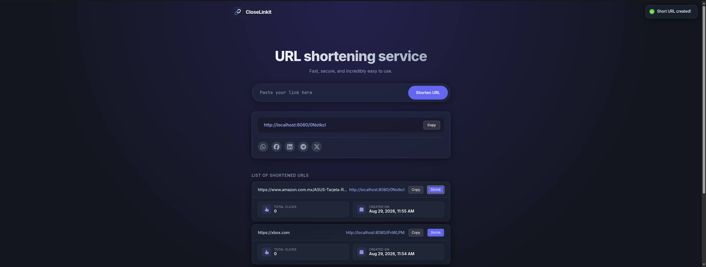
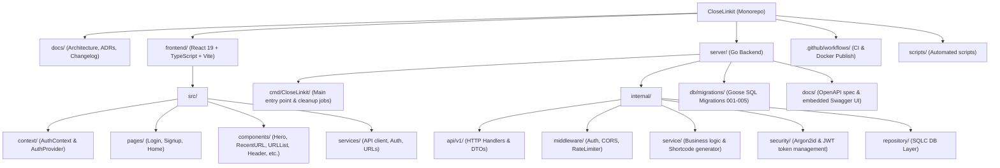
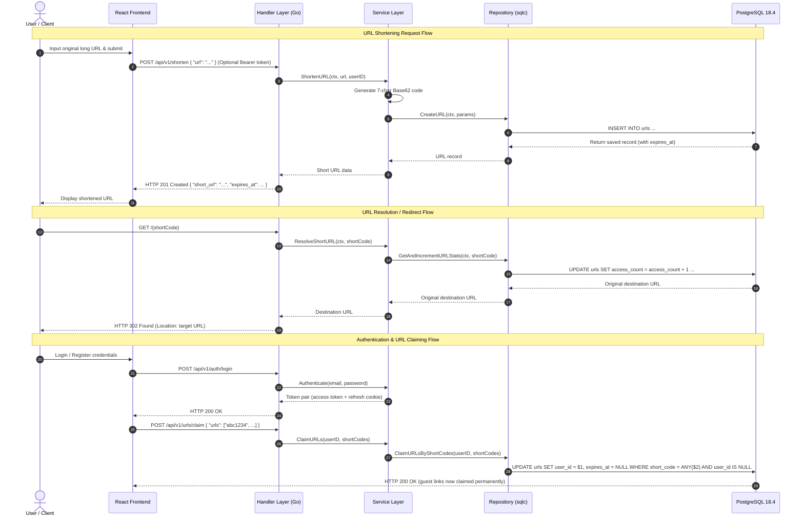

# CloseLinkit

[](https://github.com/JorgeLR0610/CloseLinkit/actions/workflows/frontend-ci.yaml)
[](https://github.com/JorgeLR0610/CloseLinkit/actions/workflows/backend-ci.yaml)

CloseLinkit is a URL shortening service composed of a Go backend, a React frontend, and a PostgreSQL database. It exposes a REST API and a web client that allows users to create, retrieve, manage, and resolve shortened URLs with authentication, link claiming, and lifecycle management.

> **Current Version:** v0.3.0



## Main Features

- **URL Shortening & Expiration:** Easily shorten long URLs. Authenticated links are permanent; anonymous links automatically expire after 7 days.
- **Fast Redirection:** High-performance HTTP 302 redirection from 7-character Base62 short codes to target URLs.
- **User Authentication & Accounts:** Secure registration and login using Argon2id password hashing, constant-time simulation against timing attacks, memory-only JWT access tokens, and rotating HttpOnly cookie refresh tokens (ADR 0010).
- **Link Management & Ownership:** Authenticated users can list all their shortened URLs, track individual statistics, and delete links with instant feedback.
- **Anonymous URL Claiming:** Automatically transfers URLs created as a guest into user accounts upon signup or login.
- **Protected Statistics & Analytics:** Authenticated access to click tracking and creation timestamps.
- **Automated Background Cleanup:** Background goroutines periodically purge expired anonymous URLs (every 12h) and expired refresh tokens (every 1h).
- **Interactive Swagger UI:** Interactive OpenAPI 3.0 documentation embedded directly at `/docs/`.
- **Hardened Distroless Container:** Production multi-stage Docker build using `gcr.io/distroless/static-debian13:nonroot` (ADR 0011) with automated GHCR image publishing on release tags.
  
## Tech Stack

| Component | Technology | Version / Tooling |
| :--- | :--- | :--- |
| **Backend** | Go (`net/http`) | 1.26.2 (Runtime) / 1.26.8 (Builder) |
| **Frontend** | React + TypeScript + Vite | React 19.3 / Vite 8.3 / Router 8.4 |
| **Database** | PostgreSQL | 18.4 |
| **SQL Code Generator** | `sqlc` | v1.31.1 |
| **Database Migrations** | `goose` | v3.27.3 |
| **Security & Authentication** | Argon2id, JWT (`golang-jwt/jwt/v5`) | RFC 7519 / RFC 9106 |
| **Security & Vulnerabilities** | `govulncheck` | Standard Go Tooling |
| **Testing Frameworks** | Vitest, React Testing Library, MSW | v5 / v16 / v2 |
| **Linters & Formatters** | `oxlint`, `oxfmt` | v1.85 / v0.70 |
| **Container & Runtime** | Docker Compose, Distroless Static | Debian 13 nonroot (ADR 0011) |

## Architecture & Data Flow

### Project Structure


```mermaid
graph TD
    Root["CloseLinkit (Monorepo)"]
    Root --> Docs["docs/ (Architecture, ADRs, Changelog)"]
    Root --> Frontend["frontend/ (React 19 + TypeScript + Vite)"]
    Root --> Server["server/ (Go Backend)"]
    Root --> Workflows[".github/workflows/ (CI & Docker Publish)"]
    Root --> Scripts["scripts/ (Automated scripts)"]
    
    Server --> Cmd["cmd/CloseLinkit/ (Main entry point & cleanup jobs)"]
    Server --> Internal["internal/"]
    Internal --> API["api/v1/ (HTTP Handlers & DTOs)"]
    Internal --> Middleware["middleware/ (Auth, CORS, RateLimiter)"]
    Internal --> Service["service/ (Business logic & Shortcode generator)"]
    Internal --> Security["security/ (Argon2id & JWT token management)"]
    Internal --> Repo["repository/ (SQLC DB Layer)"]
    Server --> DB["db/migrations/ (Goose SQL Migrations 001-005)"]
    Server --> ServerDocs["docs/ (OpenAPI spec & embedded Swagger UI)"]

    Frontend --> Src["src/"]
    Src --> Context["context/ (AuthContext & AuthProvider)"]
    Src --> Pages["pages/ (Login, Signup, Home)"]
    Src --> Components["components/ (Hero, RecentURL, URLList, Header, etc.)"]
    Src --> Services["services/ (API client, Auth, URLs)"]
```

### Data Flow Diagram


```mermaid
sequenceDiagram
    autonumber
    actor User as User / Client
    participant FE as React Frontend
    participant H as Handler Layer (Go)
    participant S as Service Layer
    participant R as Repository (sqlc)
    participant DB as PostgreSQL 18.4

    Note over User, DB: URL Shortening Request Flow
    User->>FE: Input original long URL & submit
    FE->>H: POST /api/v1/shorten { "url": "..." } (Optional Bearer token)
    H->>S: ShortenURL(ctx, url, userID)
    S->>S: Generate 7-char Base62 code
    S->>R: CreateURL(ctx, params)
    R->>DB: INSERT INTO urls ...
    DB-->>R: Return saved record (with expires_at)
    R-->>S: URL record
    S-->>H: Short URL data
    H-->>FE: HTTP 201 Created { "short_url": "...", "expires_at": ... }
    FE-->>User: Display shortened URL

    Note over User, DB: URL Resolution / Redirect Flow
    User->>H: GET /{shortCode}
    H->>S: ResolveShortURL(ctx, shortCode)
    S->>R: GetAndIncrementURLStats(ctx, shortCode)
    R->>DB: UPDATE urls SET access_count = access_count + 1 ...
    DB-->>R: Original destination URL
    R-->>S: Original destination URL
    S-->>H: Destination URL
    H-->>User: HTTP 302 Found (Location: target URL)

    Note over User, DB: Authentication & URL Claiming Flow
    User->>FE: Login / Register credentials
    FE->>H: POST /api/v1/auth/login
    H->>S: Authenticate(email, password)
    S-->>H: Token pair (access token + refresh cookie)
    H-->>FE: HTTP 200 OK
    FE->>H: POST /api/v1/urls/claim { "urls": ["abc1234", ...] }
    H->>S: ClaimURLs(userID, shortCodes)
    S->>R: ClaimURLsByShortCodes(userID, shortCodes)
    R->>DB: UPDATE urls SET user_id = $1, expires_at = NULL WHERE short_code = ANY($2) AND user_id IS NULL
    DB-->>FE: HTTP 200 OK (guest links now claimed permanently)
```

## Prerequisites

Before running CloseLinkit, ensure you have the following installed on your machine:
- **[Docker Engine](https://docs.docker.com/get-docker/)** (v20.10+ recommended)
- **[Docker Compose](https://docs.docker.com/compose/)** (v2.0+)
- **Go 1.26.2+** *(optional, required only if running migrations or tests locally outside Docker)*
- **A `.env` file** (see the [Environment Variables](#environment-variables) section below)

## Environment Variables

Copy the provided `.env.example` to `.env` and adjust the values if necessary.

```bash
cp .env.example .env
```

Below is an overview of the environment variables used across the application:

| Variable | Default Value | Description |
| :--- | :--- | :--- |
| `POSTGRES_USER` | `postgres` | Username for the PostgreSQL database container |
| `POSTGRES_PASSWORD` | `postgres123` | Password for the PostgreSQL database container |
| `POSTGRES_DB` | `CloseLinkit` | Name of the default database created on startup |
| `DB_HOST_PORT` | `5432` | Exposed PostgreSQL port on the host machine |
| `DB_TIMEZONE` | `America/Chihuahua` | Timezone configured inside the database container |
| `DB_URL` | `postgres://...` | Connection string used by the Go API container (internal container network) |
| `DB_URL_GOOSE` | `postgres://...` | Connection string used by Goose migrations running from the host machine |
| `API_HOST_PORT` | `8080` | Port on which the Go API server listens on the host |
| `BASE_URL` | `http://localhost:8080` | Public base URL used to construct short links |
| `ALLOWED_ORIGINS` | `http://localhost:5173` | Comma-separated CORS allowed origins for backend requests |
| `VITE_API_BASE_URL` | `http://localhost:8080` | API base URL consumed by the Vite React client |
| `VITE_HOST_PORT` | `5173` | Port on which the React frontend is served on the host |
| `JWT_SECRET` | `GvD/eXEuby9+cLxQyO767htLeW2xJmxkbBmJMiD2GGs=` | Symmetric key used to sign and verify JWT tokens (generate with `openssl rand -base64 32`) |
| `COOKIE_SECURE` | `true` (`false` in local HTTP) | Boolean flag controlling the `Secure` attribute of the refresh token cookie |
## Getting Started

### Option 1: Automated Setup (only for Linux/macOS)

We provide a convenient bash script to check dependencies, start the containers, and run database migrations automatically.

```bash
chmod +x scripts/setup.sh
./scripts/setup.sh
```

Once complete, open your browser and navigate to **[http://localhost:5173](http://localhost:5173)**.

### Option 2: Manual Setup

If you prefer to start the project manually, follow these steps:

1. **Create Environment File**:
   ```bash
   cp .env.example .env
   ```

2. **Start the containers in detached mode:**
   ```bash
   docker compose up -d
   ```
3. **Run database migrations (Requires Go to be installed locally):**
   ```bash
   make migrate-up
   ```
4. **Access Applications**:
   - **Frontend UI**: [http://localhost:5173](http://localhost:5173)
   - **Backend API**: [http://localhost:8080](http://localhost:8080)
   - **Interactive Swagger UI**: [http://localhost:8080/docs/](http://localhost:8080/docs/)

To stop services, execute:
```bash
docker compose down
```

## API Endpoints

The Go backend exposes a clean REST API. Full request/response schemas and interactive testing are available via **Swagger UI** at `http://localhost:8080/docs/`.

| Method | Endpoint | Description |
| :--- | :--- | :--- |
| `POST` | `/api/v1/auth/register` | Registers a new user account |
| `POST` | `/api/v1/auth/login` | Authenticates user credentials and returns JWT access + refresh tokens |
| `POST` | `/api/v1/auth/refresh` | Refreshes an expired access token using a valid refresh token |
| `POST` | `/api/v1/auth/logout` | Revokes the refresh token and ends the session |
| `POST` | `/api/v1/shorten` | Shortens a long URL (optionally associates with authenticated user if Bearer token is provided) |
| `GET` | `/api/v1/urls` | Retrieves all shortened URLs for the authenticated user (Requires Bearer token) |
| `POST` | `/api/v1/urls/claim` | Claims anonymous URLs for the authenticated user and removes expiration (Requires Bearer token) |
| `DELETE` | `/api/v1/urls/{shortCode}` | Deletes a shortened URL owned by the authenticated user (Requires Bearer token) |
| `GET` | `/api/v1/{shortCode}/stats` | Retrieves access counts and statistics for a short code (Requires Bearer token) |
| `GET` | `/{shortCode}` | Resolves short code and issues an HTTP 302 redirect to original URL |
| `GET` | `/docs/` | Serves embedded Swagger UI documentation |
| `GET` | `/openapi.yaml` | Serves the OpenAPI 3.0 specification file |

## Running Tests & Quality Checks

CloseLinkit includes full test coverage and automated code quality checks for both backend and frontend.

### Backend Tests & Security Checks

To run Go backend tests and vulnerability analysis:

```bash
# Run unit tests
cd server
go test ./... -v

# Run unit tests with race detection and coverage
go test ./... -cover -race

# Run vulnerability scan (via Makefile from project root)
make govulncheck
```

### Frontend Tests & Code Quality

To run frontend tests, linting, and formatting checks:

```bash
cd frontend

# Run unit and integration tests (Vitest + MSW)
npm test

# Run tests in watch mode
npm run test:watch

# Run linter (oxlint)
npm run lint

# Check code formatting (oxfmt)
npm run format-check

# Auto-format code
npm run format

# Run TypeScript check and production build
npm run build
```

## Documentation

Full architectural decisions and system design documentation can be found in the [`docs/`](/docs) folder:

- **System Architecture**: Overview of layers and component interaction in [`docs/architecture.md`](/docs/architecture.md).
- **Architecture Decision Records (ADRs)**: Technical design choices in [`docs/ADR/`](/docs/ADR).

## Roadmap

Based on our planned evolution in [`docs/architecture.md`](/docs/architecture.md):

- [x] **Analytics Dashboard**: Analytics panel displaying total click counts and creation timestamp.
- [x] **User Authentication**: JWT-based authentication with secure HttpOnly cookie session handling and Argon2id hashing.
- [x] **User Accounts & Link Management**: Link ownership, anonymous URL claiming, per-user listing, and link deletion (editing pending).
- [x] **Hardened Containers & CI/CD**: Distroless runtime image (ADR 0011), vulnerability audits (`govulncheck`), and automated GHCR publishing via GitHub Actions.
- [ ] **Custom Short URLs**: Allow users to specify custom aliases for shortened links.
- [ ] **Link Editing**: Updating destination URLs for existing shortened links.
- [ ] **Cloud Deployment**: AWS deployment (EC2, S3, CloudFront) and Kubernetes manifests.

## License

This project is licensed under the **MIT License**. See the [`LICENSE`](/LICENSE) file for complete licensing text.
